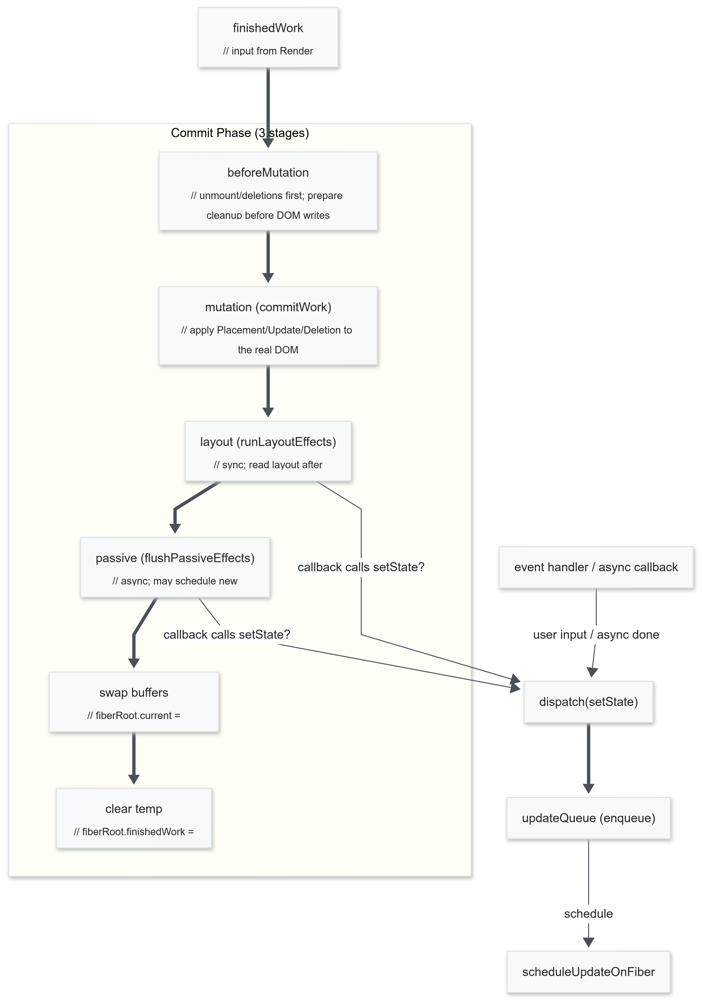

# React Core Rebuild

React의 핵심 내부 동작을 직접 구현한 학습용 프로젝트입니다.

## 프로젝트 동기

"React를 사용할 줄 아는 것"과 "React가 어떻게 동작하는지 아는 것"은 다릅니다.

이 프로젝트는 다음 질문들에 답하기 위해 시작되었습니다:
- `useState`를 호출하면 내부에서 무슨 일이 일어나는가?
- React는 어떻게 변경된 부분만 찾아서 DOM을 업데이트하는가?
- Fiber 아키텍처는 무엇이고, 왜 도입되었는가?
- Hook의 호출 순서가 왜 중요한가?

## 구현 범위

| 기능 | 구현 | 설명 |
|------|:----:|------|
| createElement (JSX) | ✅ | Virtual DOM 객체 생성 |
| Fiber Node | ✅ | 렌더링 작업 단위 |
| Fiber Tree 순회 | ✅ | DFS 기반 workLoop |
| Reconciliation | ✅ | Key 기반 Diffing 알고리즘 |
| 이중 버퍼링 | ✅ | current ↔ workInProgress |
| useState | ✅ | 상태 관리 Hook |
| useEffect | ✅ | 사이드 이펙트 (비동기) |
| useLayoutEffect | ✅ | 사이드 이펙트 (동기) |
| Commit Phase | ✅ | 실제 DOM 업데이트 |

## 아키텍처

### 전체 렌더링 파이프라인

```
render() 호출
    │
    ▼
┌─────────────────────────────────────────────────────────┐
│                    Render Phase                          │
│  (순수 계산, DOM 변경 없음, 중단 가능)                    │
│                                                          │
│  scheduleUpdateOnFiber()                                 │
│       │                                                  │
│       ▼                                                  │
│  workLoop ──► performUnitOfWork (반복)                   │
│                    │                                     │
│              ┌─────┴─────┐                               │
│              ▼           ▼                               │
│         beginWork   completeWork                         │
│         (하향식)      (상향식)                            │
│              │           │                               │
│              ▼           ▼                               │
│      reconcileChildren  DOM 노드 생성                    │
│        (Diffing)                                         │
└─────────────────────────────────────────────────────────┘
                    │
                    ▼ finishedWork
┌─────────────────────────────────────────────────────────┐
│                    Commit Phase                          │
│  (DOM 변경, 중단 불가)                                   │
│                                                          │
│  commitUnitOfWork()                                      │
│       │                                                  │
│       ├──► Deletion 처리 (effects 배열)                  │
│       │                                                  │
│       ├──► Placement: appendChild()                      │
│       ├──► Update: patchProps()                          │
│       │                                                  │
│       ├──► useLayoutEffect 실행 (동기)                   │
│       └──► useEffect 실행 (비동기, microtask)            │
└─────────────────────────────────────────────────────────┘
                    │
                    ▼
            버퍼 스왑 (current = finishedWork)
```

### 다이어그램

<table>
  <tr>
    <th>Render Phase</th>
    <th>Commit Phase</th>
  </tr>
  <tr>
    <td></td>
    <td></td>
  </tr>
</table>

## 디렉토리 구조

```
src/
├── jsx/                          # JSX 처리
│   ├── createElement.ts          # React.createElement 구현
│   ├── normalizeChildren.ts      # 자식 노드 정규화
│   └── type.jsx.ts               # 타입 정의
│
├── fiber/                        # Fiber 아키텍처 (핵심)
│   ├── type.fiber.ts             # Fiber 타입 정의
│   ├── constants.ts              # 비트 플래그 상수
│   │
│   ├── core/                     # 렌더링 엔진
│   │   ├── workLoop.ts           # 메인 루프
│   │   ├── beginWork.ts          # 컴포넌트 렌더링 시작
│   │   ├── reconcileChildren.ts  # Diffing 알고리즘 (핵심)
│   │   ├── completeWork.ts       # DOM 노드 생성
│   │   ├── commitWork.ts         # DOM 업데이트
│   │   └── ...
│   │
│   ├── hooks/                    # React Hooks
│   │   ├── useState.ts           # 상태 관리
│   │   ├── useEffect.ts          # 사이드 이펙트
│   │   ├── context.ts            # Hook 컨텍스트
│   │   ├── updateQueue.ts        # 상태 업데이트 큐
│   │   └── getNextHook.ts        # Hook 링크드 리스트
│   │
│   ├── scheduler/                # 스케줄러
│   │   └── scheduleUpdateOnFiber.ts
│   │
│   └── legacy/                   # 리팩토링 이전 버전
│       └── useState_v1/
│
├── __tests__/                    # 테스트
│   ├── createElement.test.ts
│   └── ReactDOM.test.ts
│
└── ReactDOM.ts                   # 진입점
```

## 핵심 구현 상세

### 1. Fiber Node 구조

Fiber는 렌더링 작업의 최소 단위입니다. 링크드 리스트로 트리를 표현합니다.

```typescript
interface FiberNode {
  // 노드 정보
  type: string | Function;        // "div" | Component
  key: string | number | null;    // 리스트 최적화용

  // 트리 구조 (링크드 리스트)
  child: FiberNode | null;        // 첫 번째 자식
  sibling: FiberNode | null;      // 다음 형제
  return: FiberNode | null;       // 부모

  // 이중 버퍼링
  alternate: FiberNode | null;    // 이전 렌더링의 Fiber
  stateNode: HTMLElement | null;  // 실제 DOM 참조

  // 작업 플래그 (비트 연산)
  flags: number;                  // Placement | Update | Deletion

  // 상태
  memoizedState: Hook | null;     // Hook 링크드 리스트
  memoizedProps: any;             // 렌더링된 Props
  pendingProps: any;              // 새로운 Props
}
```

**트리 순회 방식:**
```
     A
   /   \
  B     C
 / \
D   E

순회 순서: A → B → D → E → C
(child → sibling → return)
```

### 2. Reconciliation (Diffing 알고리즘)

변경된 부분만 찾아내는 핵심 알고리즘입니다.

```typescript
// reconcileChildren.ts 핵심 로직

function reconcileChildrenArray(current, workInProgress, newChildren) {
  // 1. 기존 Fiber를 Map으로 구성 (O(1) 조회)
  const oldFiberMap = buildOldFiberMap(current);

  // 2. 새 자식들 순회하며 매칭
  const newFibers = newChildren.map((child, index) => {
    const key = child.key ?? `${child.type}-${index}`;
    const oldFiber = oldFiberMap.get(key);

    // 타입이 같으면 재사용, 다르면 새로 생성
    if (oldFiber && oldFiber.type === child.type) {
      return reuseFiber(oldFiber, child.props);  // Update
    }
    return createFiber(child);                   // Placement
  });

  // 3. 사용되지 않은 기존 Fiber는 삭제 표시
  oldFiberMap.forEach(fiber => {
    fiber.flags = Deletion;
    workInProgress.effects.push(fiber);
  });

  return newFibers;
}
```

**Key의 역할:**
```jsx
// Key가 없으면: 순서 변경 시 모든 노드 재생성
// Key가 있으면: 이동만 하고 재사용

<ul>
  {items.map(item => (
    <li key={item.id}>{item.name}</li>  // key로 추적
  ))}
</ul>
```

### 3. useState 구현

상태 업데이트는 원형 링크드 리스트로 관리됩니다.

```typescript
// useState.ts

function useState<T>(initialState: T): [T, Dispatch<T>] {
  const hook = getNextHook();  // Hook 링크드 리스트에서 현재 Hook 가져오기

  // 초기화 (Mount)
  if (hook.memoizedState === null) {
    hook.memoizedState = initialState;
  }
  // 업데이트 반영 (Update)
  else {
    hook.memoizedState = processUpdateQueue(hook.queue, hook.memoizedState);
  }

  const dispatch = (action) => {
    enqueueUpdate(hook.queue, action);  // 큐에 추가
    scheduleUpdateOnFiber(fiber);       // 리렌더링 예약
  };

  return [hook.memoizedState, dispatch];
}
```

**원형 링크드 리스트 구조:**
```
setState(1) → setState(2) → setState(3)

        ┌──────────────────────┐
        │                      │
        ▼                      │
    Update1 ──► Update2 ──► Update3
                               ▲
                               │
                         pending (마지막)
```

**왜 원형인가?**
- `pending.next`로 첫 번째 접근: O(1)
- `pending`으로 마지막 접근: O(1)
- 삽입: O(1)

### 4. useEffect 구현

의존성 배열 비교 후 Effect를 스케줄링합니다.

```typescript
// useEffect.ts

function useEffect(create, deps) {
  const hook = getNextHook();
  const prevEffect = hook.memoizedEffect;

  // 의존성 비교 (얕은 비교)
  const depsChanged = !prevEffect || !isEqual(deps, prevEffect.deps);

  if (depsChanged) {
    hook.memoizedEffect = {
      create,                    // effect 함수
      destroy: prevEffect?.destroy,  // cleanup 함수
      deps,
      tag: "Passive"             // 비동기 실행
    };

    fiber.flags |= PassiveEffect;  // 플래그 추가
  }
}

// Commit Phase에서 실행
function flushPassiveEffect(fiber) {
  queueMicrotask(() => {
    // 1. cleanup 실행
    if (effect.destroy) effect.destroy();

    // 2. effect 실행
    const cleanup = effect.create();

    // 3. 새 cleanup 저장
    effect.destroy = cleanup;
  });
}
```

### 5. 이중 버퍼링 (Double Buffering)

렌더링 중 UI가 깨지지 않도록 두 개의 트리를 유지합니다.

```typescript
interface FiberRoot {
  current: FiberNode;         // 화면에 렌더링된 트리
  finishedWork: FiberNode;    // 새로 완성된 트리
}

// Render Phase: workInProgress 트리 생성
const workInProgress = createWorkInProgress(current);

// Commit Phase: 버퍼 스왑
fiberRoot.current = fiberRoot.finishedWork;
```

```
Before Commit:
┌─────────────┐    ┌─────────────┐
│   current   │    │     WIP     │
│  (화면표시)  │◄──►│  (작업중)   │
│      A      │    │     A'     │
│     / \     │    │    / \     │
│    B   C    │    │   B'  C'   │
└─────────────┘    └─────────────┘
     alternate 연결

After Commit (스왑):
┌─────────────┐    ┌─────────────┐
│     old     │    │   current   │
│             │◄──►│  (화면표시)  │
│      A      │    │     A'     │
│     / \     │    │    / \     │
│    B   C    │    │   B'  C'   │
└─────────────┘    └─────────────┘
```

### 6. 비트 플래그 (Bit Flags)

여러 상태를 효율적으로 관리합니다.

```typescript
// constants.ts
const FiberFlags = {
  NoFlags:       0b00000,  // 0
  Placement:     0b00001,  // 1  - 새로 추가
  Update:        0b00010,  // 2  - 업데이트
  Deletion:      0b00100,  // 4  - 삭제
  PassiveEffect: 0b01000,  // 8  - useEffect
  LayoutEffect:  0b10000,  // 16 - useLayoutEffect
};

// 플래그 추가 (OR)
fiber.flags |= Placement;
fiber.flags |= PassiveEffect;
// fiber.flags = 0b01001 (9)

// 플래그 확인 (AND)
if (fiber.flags & Placement) {
  // Placement 작업 수행
}
if (fiber.flags & PassiveEffect) {
  // useEffect 실행
}
```

## 실행 방법

```bash
# 의존성 설치
npm install

# 개발 서버 실행
npm run dev

# 테스트 실행
npm run test
```

## 테스트

```typescript
// createElement 테스트
describe("createElement", () => {
  test("문자열 자식을 가지는 ReactElement를 생성한다", () => {
    const element = createElement("div", { id: "main" }, "hello");
    expect(element.props.children).toEqual(["hello"]);
  });

  test("null, undefined, boolean을 필터링한다", () => {
    const element = createElement("div", null, null, "text", false);
    expect(element.props.children).toEqual(["text"]);
  });
});

// ReactDOM 테스트
describe("ReactDOM.render", () => {
  test("container에 element를 렌더링한다", () => {
    const container = document.createElement("div");
    render(createElement("h1", null, "Hello"), container);
    expect(container.innerHTML).toBe("<h1>Hello</h1>");
  });
});
```

## 학습 포인트

### 이 프로젝트를 통해 배운 것

1. **Fiber 아키텍처의 필요성**
   - Stack Reconciler의 한계 (동기식, 중단 불가)
   - Fiber의 증분 렌더링 가능성

2. **Hook의 동작 원리**
   - 왜 Hook 호출 순서가 중요한가 (링크드 리스트)
   - 왜 조건문 안에서 Hook을 호출하면 안 되는가

3. **Virtual DOM의 실체**
   - 단순한 JavaScript 객체
   - Diffing은 휴리스틱 기반 (O(n))

4. **이중 버퍼링의 역할**
   - 렌더링 중 UI 깨짐 방지
   - 작업 취소 가능한 구조

## 실제 React와의 차이점

| 항목 | 이 프로젝트 | 실제 React |
|------|-----------|-----------|
| 렌더링 | 동기식 | 비동기 (Concurrent) |
| 스케줄링 | 즉시 실행 | 우선순위 기반 |
| Diffing | 단순 Map 매칭 | Two-pass 알고리즘 |
| 이벤트 | 직접 바인딩 | 합성 이벤트 (SyntheticEvent) |
| 최적화 | 없음 | 메모이제이션, Lazy 등 |

## 리팩토링 히스토리

`legacy/useState_v1/` 폴더에 초기 구현이 보존되어 있습니다.

**v1 → 현재 버전 주요 변경:**
- 단일 상태 → 여러 Hook 지원 (링크드 리스트)
- 직접 호출 → workLoop 기반 구조화
- 단순 큐 → 원형 링크드 리스트

## 참고 자료

- [React Fiber Architecture](https://github.com/acdlite/react-fiber-architecture)
- [Build your own React](https://pomb.us/build-your-own-react/)
- [React Source Code](https://github.com/facebook/react)

## 기술 스택

- TypeScript
- Vite
- Vitest

---

*이 프로젝트는 학습 목적으로 제작되었습니다. 프로덕션 환경에서는 실제 React를 사용하세요.*
